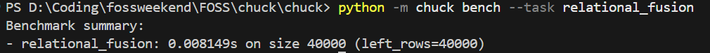

# relational_fusion — Usage Guide

`relational_fusion` performs a hash-join on two relations (left and right) and
computes aggregated summary values over the joined rows. It mirrors a common
database execution strategy: build a hash index on one side, stream the other,
and aggregate on the fly.

---

## Quick CLI usage

```bash
# benchmark all tasks (relational_fusion included)
python -m chuck bench

# benchmark only relational_fusion
python -m chuck bench --task relational_fusion

# run regression checks (validates relational_fusion against stored baselines)
python -m chuck regress
```

---

## Using the Python API directly

`generate(row_count, seed)` creates a synthetic workload of two relations.
`solve(payload)` performs the hash-join + aggregation and returns summary statistics.

Each row in the input is a `(key, value)` tuple — keys are strings like `"k002"`, values are integers in `[1, 999]`.

| Output field | Description |
|---|---|
| `left_rows` | Number of rows in the left relation |
| `right_rows` | Number of rows in the right relation |
| `join_rows` | Total rows produced by the inner join |
| `aggregate` | Sum of `(left_value + right_value)` across all joined pairs |

---

## End-to-end example script

```python
"""relational_fusion end-to-end demo."""

from chuck.tasks.relational_fusion import generate, solve

# 1. Generate a workload
payload = generate(row_count=128, seed=10)
print(f"Left rows  : {len(payload['left'])}")
print(f"Right rows : {len(payload['right'])}")

# 2. Solve
result = solve(payload)
print(f"Join rows  : {result['join_rows']}")
print(f"Aggregate  : {result['aggregate']}")

# 3. Verify against the known regression baseline (seed=10, size=128)
assert result == {
    "left_rows": 128,
    "right_rows": 64,
    "join_rows": 269,
    "aggregate": 276559,
}
print("✓ Output matches regression baseline")
```

**Expected terminal output:**

```text
Left rows  : 128
Right rows : 64
Join rows  : 269
Aggregate  : 276559
✓ Output matches regression baseline
```



---

## Benchmarking

```python
from chuck.benchmarks.relational_fusion import run

result = run()
print(f"Task    : {result['task']}")
print(f"Size    : {result['size']}")
print(f"Seconds : {result['seconds']}")
print(f"Output  : {result['output']}")
```

The benchmark uses `row_count=40_000` (the task's `benchmark_size`) by default,
giving a realistic workload for performance measurement.

---

## Native C++ backend

If the C++ native module is built, `chuck` will automatically use it for faster
execution with no code changes required — the Python fallback is used otherwise.

See [NATIVE_BINDINGS.md](../NATIVE_BINDINGS.md) for build and comparison details.
